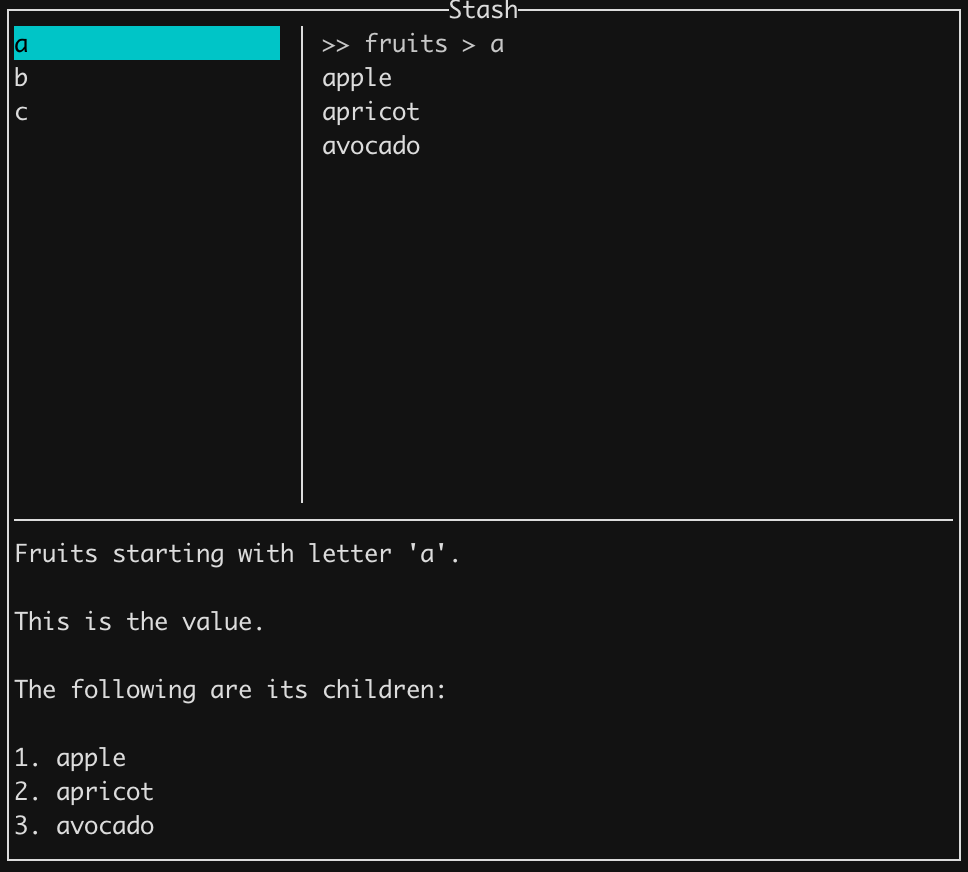

# stash

`stash` is a command line program for storing text data in encrypted form.

All user data is encrypted using [AES 256](https://en.wikipedia.org/wiki/Advanced_Encryption_Standard) cipher.

Data is hashed for indexing purposes using a good random salt + [SHA512](https://en.wikipedia.org/wiki/SHA-2).

</img>

<!-- markdown-toc start - Don't edit this section. Run M-x markdown-toc-refresh-toc -->
**Table of Contents**

- [stash](#stash)
    - [Getting Started](#getting-started)
    - [Browsing](#browsing)
        - [Terminal user interface (default)](#terminal-user-interface-default)
        - [As Markdown text](#as-markdown-text)
        - [As Org text](#as-org-text)
    - [Dumping contents to stdout](#dumping-contents-to-stdout)
        - [As Markdown text](#as-markdown-text-1)
        - [As Org text](#as-org-text-1)
    - [Backing up data](#backing-up-data)
    - [Babashka pod support](#babashka-pod-support)
    - [Shell Autocompletion](#shell-autocompletion)
        - [bash](#bash)
        - [zsh](#zsh)
        - [fish](#fish)
    - [Credits](#credits)

<!-- markdown-toc end -->

## Getting Started

Create a stash file.

```
stash create {path-to-stash-file}
```

Replace `{path-to-stash-file}` with path to the stash file. For example `~/Dropbox/secret.stash`.

Stash will prompt for the encryption-key (password) to use for the file. The key is not saved anywhere, but a
salted hash (good random salt + SHA512) of the key and the salt is saved.

When we run a stash command, we will be prompted for our encryption key. It is checked against the hash stored during
`stash create`. For the duration of the command, the encryption key will be used for encrypting/decrypting data.

The salt stored during `stash create` is also used for hashing any data for indexing purposes.

## Browsing

### Terminal user interface (default)

```
stash browse {path-to-stash-file}
```

| Shortcuts              | Description                                      |
|------------------------|--------------------------------------------------|
| ESC (q)                | Quit                                             |
| ?                      | Show this help                                   |
| +                      | Add a new key                                    |
| >                      | Add a child key to selected key                  |
| -                      | Delete selected key                              |
| , (r)                  | Rename selected key                              |
| /                      | Search and sort by pattern                       |
| y                      | Copy value of selected key into system clipboard |
| Enter                  | Set value of selected key                        |
| H                      | See history of values of selected key            |
| Left arrow (h)         | Move to parent of selected key                   |
| Right arrow (l)        | Move to child of selected key                    |
| Up arrow (k, Ctrl-p)   | Select above                                     |
| Down arrow (j, Ctrl-n) | Select below                                     |
| g, G                   | Move to top, Move to bottom                      |
| Ctrl-u, Ctrl-d         | Scroll keys half page up / down                  |
| Ctrl-b, Ctrl-f         | Scroll keys one page up / down                   |

### As Markdown text

```
stash browse -f markdown {path-to-stash-file}
```

Opens as markdown text in default editor. Set EDITOR environment variable to your editor command. Defaults to vim.

### As Org text

```
stash browse -f org {path-to-stash-file}
```

Opens as Org text in default editor. Set EDITOR environment variable to your editor command. Defaults to vim.

## Dumping contents to stdout

### As Markdown text

```
stash dump -f markdown {path-to-stash-file}
```

### As Org text

```
stash dump -f org {path-to-stash-file}
```

## Backing up data

```
stash backup {path-to-stash-file}
```

Creates a timestamped copy of stash file in the same directory as the original file.

## Babashka pod support

`stash` exposes a [bencode](https://en.wikipedia.org/wiki/Bencode) interface using [Babashka Pod Protocol](https://github.com/babashka/pods#the-protocol).

If you are familiar with babashka, see [bb-example](https://github.com/rorokimdim/stash/tree/master/bb-example).

## Shell Autocompletion

### bash

`source` output from following command

```
stash --bash-completion-script `which stash`
```

### zsh

Create a `_stash` in your $FPATH (try `~/.zsh/_stash`) with contents from following command

```
stash --zsh-completion-script `which stash`
```

### fish

`source` output from following command

```
stash --fish-completion-script `which stash`
```

## Credits

1. [Haskell](https://www.haskell.org/)
2. All of these [libraries](https://github.com/rorokimdim/stash/blob/master/package.yaml#L21) and all the things they depend on
3. [sqlite](https://sqlite.org/)
